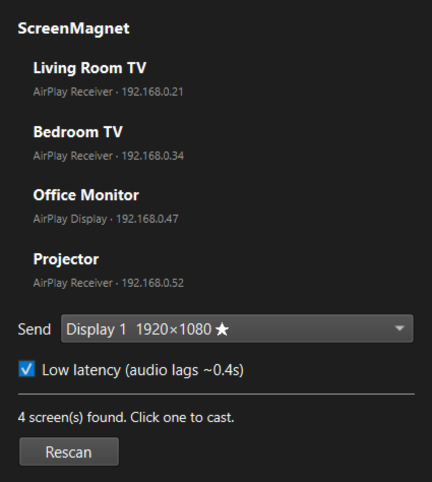

<picture>
  <source media="(prefers-color-scheme: dark)" srcset="app/assets/screenmagnet-wordmark-dark.svg">
  
</picture>

**Cast this machine's screen to a TV, from the system tray.**

A phone or a Mac can throw its display at a TV in two taps. A Windows or Linux desktop
can't — there's no built-in sender. ScreenMagnet closes that gap, over AirPlay.

Click the tray icon → two arrows chase each other while it scans → your screens appear by
name → click one. If the TV wants a pairing code, a box appears inline. Pick which monitor
goes to the TV if you have more than one.

**Status: release-readiness preview (0.84).** Linux has a verified AppImage build.
Windows packaging is being rebuilt from matching sender source. Real receiver,
pairing, audio and multi-monitor checks remain required for the new packages.
The earlier measured Linux cast achieved 1920×1080 at 30 fps with audio and
roughly 1 second of end-to-end latency; that is one measured setup, not a promise
for every TV or network.

> Not affiliated with or endorsed by Apple. AirPlay is Apple's protocol and trademark;
> ScreenMagnet is an independent, reverse-engineered client, same territory as projects like
> shairport-sync and UxPlay.

---

## What it looks like

It lives in the system tray, out of the way until you want it:


Click it and every AirPlay screen on your network is one more click away:



<sub>Device names above are examples.</sub>

---

## Install

See the [installation guide](docs/INSTALL.md) for Windows setup, Linux AppImage
installation, capture dependencies, updates, and removal.

- **Windows x64:** `ScreenMagnet-Setup.exe` includes the application and matching
  AirPlay sender. Setup downloads official GStreamer and Visual C++ prerequisites
  when needed; internet and a normal Windows administrator prompt are required.
- **Linux x86_64:** download the AppImage, checksum, `install-appimage.sh`, and
  `screenmagnet.svg` into one folder. Run `bash install-appimage.sh` to add the
  app to your user application menu. The launcher works without FUSE.
- **SteamOS/Bazzite:** use Desktop Mode and the documented distrobox capture setup.
  The installer does not unlock or modify an immutable host OS.

Preview packages are staged as draft releases during readiness review. There is
no public stable release yet. Python/Qt and source/license materials are included;
Linux GStreamer/capture integration remains an external dependency.

## Running from source

```bash
app/run.sh        # Linux
app\run.bat        # Windows
```

To prepare the isolated source environment and install the application-menu entry:

```bash
bash ./screenmagnet-linux.sh setup-source
packaging/linux/install-desktop-entry.sh              # --uninstall to remove
```

Run it from a terminal in `app/`, or use the desktop entry above. Launching
`python -m screenmagnet` from anywhere else fails with `No module named
screenmagnet` unless the package is installed into the venv -- the plain
`-m` form finds it via the current directory.

Source mode supports **Python 3.13 and 3.14**. Dependencies live in a managed
venv instead of the distribution Python. The release AppImage is frozen with
Python 3.13 for repeatability and requires no host Python:

```bash
bash ./screenmagnet-linux.sh setup-source
```

```powershell
py -3.13 -m venv $env:LOCALAPPDATA\screenmagnet\venv
& $env:LOCALAPPDATA\screenmagnet\venv\Scripts\pip install PySide6-Essentials==6.11.1 zeroconf==0.150.0
```

Then point it at a built `doubletake` (the AirPlay sender — see [The engine](#the-engine)):

```bash
setx SCREENMAGNET_DOUBLETAKE "C:\path\to\doubletake"      # Windows, folder containing bin\doubletake.exe
export SCREENMAGNET_DOUBLETAKE=/path/to/doubletake         # Linux, folder containing bin/doubletake
```

Use `bash ./screenmagnet-linux.sh test` for offline packaging checks. The existing
`app/tests/smoke_test.py` adds native encoder, monitor, and live LAN discovery checks.

## Layout

```
app/                    the PySide6 tray application
  screenmagnet/
    tray.py              tray icon + popup panel
    spinner.py           the chasing-arrows scan indicator
    discovery.py         mDNS discovery, with reachability verification
    monitors.py          monitor enumeration (Qt, xrandr fallback)
    caster.py            drives the AirPlay sender, parses its state
  tests/smoke_test.py    9 checks incl. live discovery
  run.sh / run.bat
docs/                    measured research findings
patches/                 our fixes to the AirPlay sender (see below)
packaging/               installer build scripts (PyInstaller + Inno Setup)
spike/                   build scripts + the latency measuring tool
```

## Why a container

SteamOS (and similarly locked-down hosts) ship **no H.264 GStreamer encoder at all** —
`x264enc`, `openh264enc`, `vah264enc` and `vaapih264enc` are all absent — and a read-only
root filesystem blocks installing them. ScreenMagnet detects this: if your host has a usable
H.264 encoder already, it runs the sender directly (same as Windows); if not, it falls back to
running inside a [distrobox](https://github.com/89luca89/distrobox) container that has one.
The VA-API driver is often present even when the plugin isn't — the silicon can encode,
GStreamer just has no path to it without the container.

`xorg-xrandr` must be installed inside the container too. Without it the sender silently
falls back to capturing every monitor at once and squashing them into the TV.
`setup-steamos` installs it and refuses to report success if it is absent.

## The engine

Streaming is done by [omarroth/doubletake](https://github.com/omarroth/doubletake) (Go,
LGPL-3.0+) — as far as we can tell the only working AirPlay *sender* for Linux, and now
Windows too. It is not vendored here; `patches/` holds our changes against upstream `8ccea5f`.

| Fix | Why |
|---|---|
| `videoscale` in the capture pipeline | Encoded the source monitor's native resolution while telling the receiver a different size — **black screen** for anyone whose monitor ≠ their TV. |
| `-monitor <output>` | Previously always cropped to the primary monitor. |
| `-playout-floor-ms` | Overrides a 500ms audio jitter margin that video inherits. Took latency 1.4s → 1.0s. |
| `-key-int` | Keyframe interval, for latency experiments. |
| Windows capture backend | `d3d11screencapturesrc` / DXGI Desktop Duplication, streamed over a loopback TCP socket instead of stdout (Windows' text-mode stdio otherwise corrupts the binary stream). |
| Real encoder probing | `-hwaccel auto` used to pick whatever encoder's element factory was *registered*, regardless of whether the hardware was actually present — killing the pipeline on its first frame (observed: NVENC selected on an AMD box). It now probes by encoding two real test frames first. |
| Muted at session setup | Setup sent `volume: 20`, but AirPlay volume is decibels and **0 is the maximum** — 20 dB above it, so receivers clamped to full and every cast slammed the TV to 100% on connect. Now starts at `-144` (muted); callers raise it deliberately. |

## Known limitations

- The rebuilt Windows sender includes reconstructed video and WASAPI audio paths.
  Automated startup and synthetic encoding checks do not establish live TV/audio
  compatibility. Treat Windows casting as a preview until tested with your receiver.
- Linux AppImage startup is verified on Ubuntu 22.04 and 24.04. Actual casting needs
  GStreamer, a working screen-capture session, and a reachable AirPlay receiver.
- SteamOS/Bazzite Desktop Mode, Fedora and Arch are additional device-test targets;
  Gaming Mode, ARM and Alpine/musl are not supported by this x86_64 package.
- Extended display on Windows requires a separately installed virtual-display driver.
  Mirror mode does not require that driver.
- Preview installers are unsigned. Packaged updates are downloaded from Releases;
  the development checkout's Git updater is not used to replace a frozen app.

## Latency

1.0s end-to-end, measured with `spike/latency-clock.py` — put it on the mirrored monitor,
photograph the source and TV together, subtract.

About 500ms of the original 1.4s was the sender's own conservative playout floor, applied to
receivers that don't advertise FairPlay SAP. It exists because those receivers drop audio they
can't schedule ahead, and video inherits it to stay in sync. Turning it off is a real trade:
**audio then runs ~0.4s behind and may glitch.** Good for mirroring a desktop; not for anything
where the sound matters. There's a toggle in the panel.

The remaining ~1.0s is inside the TV and isn't reachable from here. Two things that look like
they should help and measurably don't: shortening the keyframe interval, and disabling audio.
And *lowering* `-target-latency-ms` is a no-op — the code only ever raises that value.

## Notes

- Discovery verifies a real TCP connect before offering a screen. mDNS caches serve records
  for devices that have already left the network, and connecting to one that isn't there
  hangs rather than failing.
- On Plasma 6 the tray is a StatusNotifierItem, so `QSystemTrayIcon.geometry()` is usually
  empty — the popup anchors on the cursor instead, and re-anchors whenever its content
  changes so a long list can't push it off-screen.
- On Windows, monitors are identified by device path (`\\.\DISPLAY1`) rather than name —
  select by the dropdown in the panel, not by editing config by hand.
- Wi-Fi Direct / Miracast is impossible on the reference SteamOS kernel: the mt76 driver only
  gained `P2P_DEVICE` in Linux 6.14. AirPlay needs none of it.

## Support development

ScreenMagnet is free and open source. [Support development with PayPal](https://www.paypal.com/cgi-bin/webscr?cmd=_donations&business=demurphy242%40gmail.com&item_name=Support+ScreenMagnet+development&currency_code=USD)—choose any amount. Contributions are optional.

## License

ScreenMagnet itself is licensed under **GPL-3.0-or-later** (see [`LICENSE`](LICENSE)).
`patches/` are modifications to `doubletake` and inherit its **LGPL-3.0+**.
